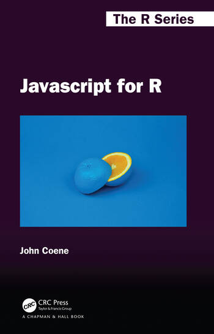
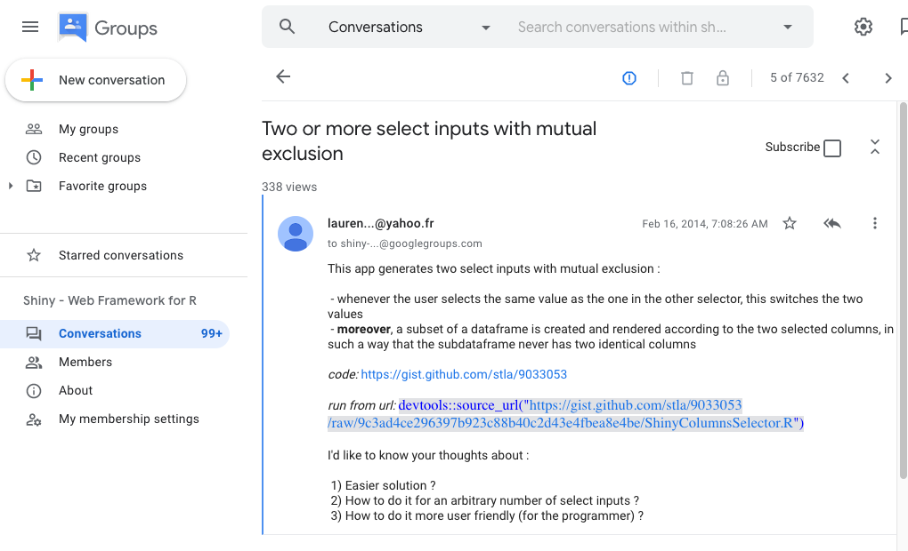
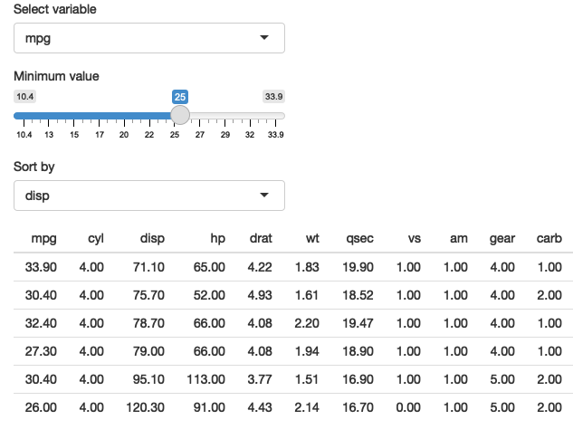

```{r setup, include=FALSE}
options(htmltools.dir.version = FALSE, width = 70)

knitr::opts_chunk$set(
  fig.width=9, fig.height=3.5, fig.retina=3,
  out.width = "100%",
  cache = FALSE,
  echo = FALSE,
  message = FALSE,
  warning = FALSE,
  fig.show = FALSE,
  hiline = TRUE
)

footer_spacing <- function(left_spaces = 20, 
                           right_spaces = 8,
                           center_title = "R/Pharma 2021",
                           right_title = "github.com/rpodcast/rph2021_shinynirvana",
                           left_title = "bit.ly/rph2021shiny", 
                           footer_class = "my-footer") {
  footer_content <- paste0(left_title, paste(rep("&emsp", left_spaces), collapse=";"), ";", center_title, paste(rep("&emsp", right_spaces), collapse=";"),  ";", right_title)
  glue::glue('<div class="{footer_class}"><span>{footer_content}</span></div>')
}


```


layout: true

`r footer_spacing(left_spaces = 30, right_spaces = 20)`

---

```{r xaringan-themer, include=FALSE, warning=FALSE}
library(xaringanthemer)
# style_duo_accent(
#   primary_color = "#1381B0",
#   secondary_color = "#FF961C",
#   inverse_header_color = "#FFFFFF"
# )
style_mono_light(
  base_color = "#23395b",
  colors = c(
    red = "#f34213",
    purple = "#3e2f5b",
    orange = "#ff8811",
    green = "#136f63",
    white = "#FFFFFF"
  )
)
```

```{r xaringan-panelset, echo=FALSE}
xaringanExtra::use_panelset()
```

class: title-slide, right, middle
background-image: url("assets/images/road_mountain.jpg")
background-position: center
background-size: cover

<style>
div.transbox {
  margin: 30px;
  background-color: #ffffff;
  border: 1px solid black;
  opacity: 0.6;
  padding-top: 20px;
  padding-right: 20px;
  padding-bottom: 20px;
  padding-left: 20px;
}

div.transbox h1 {
  color: #000000;
}

div.transbox h2 {
  color: #000000;
}

div.transbox h3 {
  color: #000000;
}

div.transbox h4 {
  color: #000000;
}
</style>




.pull-right[
.transbox[
# `r rmarkdown::metadata$title`

## `r rmarkdown::metadata$subtitle`

### `r rmarkdown::metadata$author`

### `r rmarkdown::metadata$date`

### Slides available at [bit.ly/rph2021shiny](https://bit.ly/rph2021shiny)
]
]

---
name: hello
background-image: url("assets/images/sky_background.jpg")
background-position: center
background-size: cover
class: middle, center

# .black[Hello!]


<style>
.link-box {
  background-color: #caeded;
  font-size: 8em;
  width: 50%;
}
</style>

.link-box[
[`r icons::fontawesome("github")` @rpodcast](https://github.com/rpodcast)  
[`r icons::fontawesome("twitter")` @theRcast](https://twitter.com/thercast)  
[`r icons::fontawesome("microphone")` r-podcast.org](https://r-podcast.org)  
[`r icons::fontawesome("youtube")` ShinyDevSeries](https://youtube.com/shinydeveloperseries)  
[`r icons::fontawesome("link")` rweekly.org](https://rweekly.org)  
[`r icons::fontawesome("twitch")` rpodcast](https://twitch.tv/rpodcast)  
[`r icons::fontawesome("discord")` streamRs](https://discord.gg/X9CGQ6dwxZ)
]


---
class: middle, center

<iframe frameborder=0 src="https://shiny.rstudio.com/gallery/#user-showcase" style="position:absolute;top:0.55%;left:0.46%;width:1200px;height:600px;"></iframe>

---
class: middle, center, inverse

# In the early days...

---
background-image: url("assets/images/monitor.png")
background-size: 70%



---

# On the other side of the screen...

.pull-left[

]

.pull-right[
* Amazing possibilities with Shiny apps (many from R/Pharma!)
* But ... 
* How can I go from a prototype to __those__ applications?
* Is it possible without switching careers to a full time web developer?
]

.center[
## The Power is Within Reach!
]

---
layout: false

<div id="my_video">
<video width="100%" height="100%" autoplay>
    <source src="assets/videos/rpharma_demo_final.mp4" type="video/mp4">
</video>
</div>


---
class: middle
background-image: url("assets/images/engineering_shiny.jpg")
background-position: left
background-size: 40% 90%

<div style="position:absolute;top:95%;left:10%;width:500px;height:100px;">
<a href="https://engineering-shiny.org">engineering-shiny.org</a>
</div>

.pull-right[
## Engineering Production-Grade Shiny Apps

### Colin Fay, Sebastien Rochette, Vincent Guyader, Cervan Girard
* __Trust the Process__ (of robust Shiny development)
* Embrace the software mindset by using [`{golem}`](https://thinkr-open.github.io/golem/)
* Logical workflow to build apps piece by piece
]

---
class: middle
background-image: url("assets/images/mastering-shiny-cover.png")
background-position: left
background-size: 40% 90%

<div style="position:absolute;top:95%;left:10%;width:500px;height:100px;">
<a href="https://mastering-shiny.org/">mastering-shiny.org</a>
</div>

.pull-right[
## Mastering Shiny

### Hadley Wickham

* Balanced approach of practical examples and fundamentals
* Demystifying the _magic_ of reactivity
* Reinforces powerful techniques for general R development
]

---

## Tidy Evaluation within Shiny

.panelset[
.panel[.panel-name[Shiny App]

]

.panel[.panel-name[UI Code]
```r
ui <- fluidPage(
  selectInput("var", "Sort by", choices = names(mtcars)),
  checkboxInput("desc", "Descending order?"),
  tableOutput("data")
)
```
]

.panel[.panel-name[Server Code]
```r
server <- function(input, output, session) {
  sorted <- reactive({
    if (input$desc) {
      arrange(mtcars, desc(.data[[input$var]]))
    } else {
      arrange(mtcars, .data[[input$var]])
    }
  })
  output$data <- renderTable(sorted())
}
```

]
]
---
class:middle

<!-- style="position:absolute;top:0.55%;left:0.46%;width:600px;height:650px;" -->
<iframe frameborder=0 src="https://unleash-shiny.rinterface.com/mobile-pwa.html" style="position:absolute;top:0.55%;left:0.46%;width:600px;height:600px;"></iframe>

<div style="position:absolute;top:90%;left:10%;width:500px;height:100px;">
<a href="https://unleash-shiny.rinterface.com">unleash-shiny.rinterface.com</a>
</div>

.pull-right[
## Outstanding User Interfaces with Shiny

### David Granjon

* Connects important relationships between Shiny and web technologies
* Recipes for creating custom UI templates
* Uncovers the virtual JavaScript links between inputs and server sessions
]

---

## Powerful theming with {bslib}

.panelset[
.panel[.panel-name[Shiny App]

]

.panel[.panel-name[Theme code]
```r
my_theme <- bs_theme(
    bg = "#0090f9", 
    fg = "#f0f0e6", 
    primary = "#71cc65", 
    base_font = font_google("Oswald", local = FALSE),
    "font-size-base" = "1.1rem"
  )
```
]

.panel[.panel-name[Within UI]
```r
fluidPage(
      theme = my_theme,
      ...
)
```
]
]

---
class: middle
background-image: url("assets/images/javascript_r.jpg")
background-position: left
background-size: 35% 90%

<div style="position:absolute;top:95%;left:10%;width:500px;height:100px;">
<a href="https://book.javascript-for-r.com">book.javascript-for-r.com</a>
</div>

.pull-right[
## Javascript for R

### John Coene
* Uncovers the engine behind HTML widgets powered by Javascript
* Comprehensive drilldowns of practical use cases inside and outside of Shiny
* Next generation of creating your own widget with [`{packer}`](https://packer.john-coene.com)
]

---

```{css, echo = FALSE}
.flag {
    margin-right: 8px;
    height: 21px;
    border: 1px solid #f0f0f0;
}
```

```{r, echo=FALSE}
library(dplyr)
library(plotly)
library(reactable)
library(htmltools)
library(crosstalk)

df_overall <- readRDS("data/df_overall.rds")

df_tmp <- readRDS("data/df_chart.rds") %>%
  select(player_name, plot_emoji2) %>%
  distinct()

df <- left_join(df_overall, df_tmp, by = "player_name") %>%
  select(position_emo, player_name, country, url, n_top3, total_points, avg_margin_victory, avg_time_from_first, n_first_race, plot_emoji2)

shared_df <- SharedData$new(df)

p1 <- plot_ly(shared_df, x = ~n_top3, y = ~total_points) %>%
  highlight(on = "plotly_selected") %>%
  add_text(
    text = ~plot_emoji2,
    hovertext = ~player_name,
    hoverinfo = "text",
    size = I(30)
  ) %>%
  layout(
    yaxis = list(title = "Grand Prix Points"),
    xaxis = list(title = "Number of Top 3 Finishes"),
    font = list(size = 16)
  )

t1 <- reactable(
  shared_df,
  selection = "multiple",
  onClick = "select",
  columns = list(
    position_emo = colDef(
      name = "",
      width = 30,
      cell = function(value, index) {
        emo_val <- dplyr::slice(df, index) %>% dplyr::pull(position_emo)
        emo::ji(emo_val)
      }
    ),
    player_name = colDef(
      name = "Player",
      width = 160
      # cell = function(value, index) {
      #   # grab appropriate record from country flag data frame
      #   country_select <- dplyr::slice(df, index) %>% dplyr::pull(country)
      #   country_url <- dplyr::slice(df, index) %>% dplyr::pull(url)
      #   div(img(class = "flag", src = country_url), value)
      # }})
    ),
    country = colDef(show = FALSE),
    url = colDef(show = FALSE),
    n_top3 = colDef(show = FALSE),
    total_points = colDef(name = "Points", width = 100),
    avg_margin_victory = colDef(
      name = "Avg Margin of Victory",
      cell = function(value, index) {
        avg_margin_victory <- dplyr::slice(df, index) %>% dplyr::pull(avg_margin_victory) %>% round(., 3)
        n_first_race <- dplyr::slice(df, index) %>% dplyr::pull(n_first_race)
        
        if (n_first_race < 1) {
          res <- "No wins"
        } else {
          win_text <- ifelse(n_first_race < 2, "win", "wins")
          res <- glue::glue("{avg_margin_victory} ({n_first_race} {win_text})")
        }
        
        return(res)
      }
    ),
    avg_time_from_first = colDef(show = FALSE),
    #avg_time_from_first = colDef(name = "Avg Time Behind First", width = 100, format = colFormat(digits = 3)),
    n_first_race = colDef(show = FALSE),
    plot_emoji2 = colDef(show = FALSE)
  )
)
```


.panelset[
.panel[.panel-name[Outside]
```{r echo=FALSE}
div(
  div(p1, style="float:left;width:46%"),
  div(t1, style="float:right;width:52%")
)
```
]

.panel[.panel-name[Inside]
```{r, echo=TRUE, eval=FALSE}
library(crosstalk)
library(reactable)
library(plotly)
library(htmltools)

shared_df <- SharedData$new(df)

p1 <- create_plot(shared_df, ...)
t1 <- create_reactable(shared_df, ...)

div(
  div(p1, style="float:left;width:46%"),
  div(t1, style="float:right;width:52%")
)
```
]
]

---

## The Destination is within reach!

.pull-left[

]

.pull-right[

* Unlike the early days, comprehensive resources are now available to bring you closer to Shiny Nirvana!
* Additional Resources
    + [shiny.rstudio.com/app-stories](https://shiny.rstudio.com/app-stories/)
    + [shinydevseries.com](https://shinydevseries.com)
    + [hosting.analythium.io](https://hosting.analythium.io/)
]
